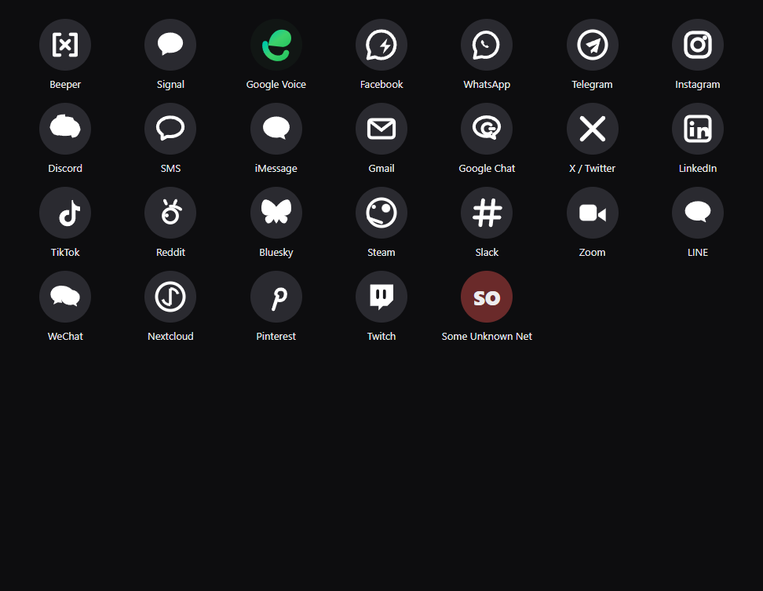

# Better Beeper

A desktop chat client for [Beeper Desktop](https://beeper.com), built on Beeper's
[Desktop API](https://developers.beeper.com/desktop-api/).

The chat UI talks to Beeper's REST API and its live WebSocket event stream. An optional
AI assistant panel talks to Beeper's built-in **MCP** server, so a model can search and read
your chats — and send, with every action shown to you before it happens.

> **No screenshots in this repository.** The development captures of this app show real contact
> names, phone numbers and private message text, so they are deliberately not published. The one
> image below is a synthetic sheet of the hand-drawn network glyphs and contains no user data.

---

## Features

**Chat**
- Sidebar across every connected network, with unread counts, pins, mutes, drafts and archive
- **The header is a real view switcher.** "Inbox ▾" opens a menu of Inbox / Unread / Archive,
  the current one is marked, and the label follows the view you pick
- **There is no Voice calls row, deliberately.** Beeper's Desktop API has **no calls endpoint
  anywhere** — the v1 spec covers chats, messages, contacts, assets, search and setup — so a
  call-history entry could never list a single call. It was built once to confirm that against
  the live spec, then removed rather than shipped as a permanent "unavailable"
- **Your note chats are pinned to the top of the list and are otherwise ordinary rows** —
  same height, same padding, same preview line as every other chat, with a 📌 explaining why
  they are up there. Clicking one opens the note; its avatar is your profile picture, so it does
  not open the image viewer
- **Brand glyphs for the source network** on every avatar — Signal, Google Voice, Facebook,
  WhatsApp, Instagram, Telegram, Discord and ~20 more, drawn as inline SVG on a brand-coloured
  disc. An unmapped bridge falls back to a monogram, so a new network still reads correctly.
  **Google Voice uses its real green-gradient mark** on a near-black disc, because a green glyph
  on a green disc is invisible. **Facebook / Messenger is the lowercase `f`**, which is the part
  of the logo that actually survives being shrunk to 16 px on a coloured disc
- A bubble in a multi-network chat also carries its own network badge, so you can see which
  bridge a message actually arrived on
- **Drag the divider** between the list and the thread to resize the conversation list
  (200–620px). Double-click the divider to reset it, or focus it and use the arrow keys
- The window is freely resizable, and **both the window size and the list width are
  remembered** between runs
- Thread view with day dividers, read receipts, reply quoting, and per-message hover actions
- Beeper-style bubbles: timestamp sits *inside* the bubble at its trailing edge, and sender
  names are hidden in one-to-one chats because the header already says who you are talking to
- Send, edit, delete, and emoji-react to messages
- Attach files (uploaded to Beeper, then referenced by the message)
- Independent vertical scrolling for the chat list and the message thread, with infinite
  scroll backwards through history
- Opening a chat always lands on its newest message, even when you were scrolled up in the
  previous one and even when images are still decoding
- **Hover any row to archive it** without opening it — the button flips to "Move back to inbox"
  on the same row once archived, so the Archive view is a two-way door
- Mute / pin / archive / mark-unread straight from the thread header
- `Esc` closes the open chat and returns you to the list
- Desktop notifications for messages that arrive while the window is in the background, with
  a full preference set in **Settings → Notifications** — including a master switch to turn
  them off entirely

**Tooltips**
- Every icon button has a hover tooltip — a custom one, not the browser's native `title`,
  so it matches the app's styling and never flashes late
- Tooltips flip above or below the button depending on available space, and appear after a
  420 ms dwell so they don't fire as the pointer crosses the toolbar
- Labels are **state-aware**: the archive button reads "Archive chat" until you archive, then
  "Move back to inbox". Same for mute and pin

**Chat list layout**
- Collapsible search and filter rows under the Inbox header, matching Beeper's compact header
- Rows are ordered the way Beeper orders them: notes to self, then pinned, then unread, then the
  rest by recency; archived chats drop out of the main list entirely. Ordering is
  the *only* thing pinning changes — it never resizes a row

**Image viewer**
- Click any image or avatar and it opens in its **own frameless window on top of the app**,
  sized to fill **the same monitor the Better Beeper window is on** — so it never appears over
  a different screen you happen to be working in
- The window is always-on-top at `screen-saver` level and visible on all workspaces, so it
  stays put over full-screen apps; only one viewer exists at a time, and closing it hands
  focus back to the chat
- **Mouse wheel / trackpad** to zoom, anchored on the pointer so the pixel under the
  cursor stays put
- **Click and drag** to pan once zoomed in (10%–1200%)
- Double-click to toggle between fit and 2.5x, `+` / `-` to step, `0` to reset, and `Fit` to
  re-fit after resizing the screen
- Click without dragging, `Esc`, or the ✕ to close

**Search**
- One box for both chat titles and full message history
- Scope filter (All / Chats / Messages), with the query highlighted in results
- Clicking a result jumps to that exact message in its thread

**New chat**
- Search contacts for any account and start single or group conversations

**Live**
- WebSocket event stream with automatic reconnection and backoff
- Messages, reactions and chat state update in place; the open chat is always subscribed,
  even when it is not one of the most recent

**Assistant (MCP)**
- Connects to Beeper's built-in MCP server at `http://localhost:23373/v0/mcp`
- Streams its replies and shows every tool it calls, with arguments and results
- BYO model: any OpenAI-compatible endpoint (OpenAI, OpenRouter, Groq, Ollama, LM Studio,
  vLLM…) or Anthropic. The key is encrypted in your OS keychain and only used from the main process.

**Security**
- OAuth 2.0 + PKCE with dynamic client registration — no manual token copy-paste
- Access token and AI key encrypted at rest via Electron `safeStorage` (DPAPI on Windows)
- `contextIsolation` on, `nodeIntegration` off, strict CSP
- Message HTML run through a DOM-based allowlist sanitizer, so a chat can never inject markup
- Local media served over a dedicated `beeper-file://` protocol rather than by disabling `webSecurity`

---

## Requirements

- **Beeper Desktop** running on this machine, with the Desktop API enabled
  (Beeper → Settings → Integrations → Desktop API). It listens on `http://localhost:23373`.
- **Node.js 20+** to build and run from source.

## Run from source

```bash
npm install
npm start
```

On first launch the app detects Beeper, then walks you through approval: it registers itself
as an OAuth client, opens Beeper's own consent dialog, and exchanges the result for a token.
You click **Approve** once; the token is stored encrypted and reused on every later launch.

If you would rather paste a token yourself, use **Use a token instead** on the connect screen
(create one in Beeper → Settings → Integrations → Approved connections → **+**).

## Build and install

```bash
npm run dist           # build the installer, then silently replace the installed app
npm run dist:only      # build only, leave the installed app alone
npm run deploy         # re-run just the install, using the installer already in release/
npm run deploy:check   # report what would happen, install nothing
npm run pack           # unpacked build -> release/win-unpacked/

npm run check:notify   # notification preference logic
npm run check:send     # optimistic-send bubble absorption
npm run check:icons     # network glyphs, including the self-coloured Google Voice mark
npm run check:live     # send a real message, then assert the thread and the list are intact
```

`npm run dist` is the one command you need. It builds the NSIS installer and then runs it
with `/S`, so the copy in **Start menu -> Better Beeper** is replaced for you. You never
run the setup file by hand.

`tools/install-update.js` does the install side:

1. **Finds the existing install** through the per-user uninstall registry key, so a custom
   install directory still works. Falls back to `%LOCALAPPDATA%\Programs\Better Beeper`.
2. **Closes any running copy** (the app runs as 4 processes) — the installer cannot replace
   locked files, so an open window would otherwise fail the install.
3. **Runs the installer silently** via NSIS `/S` and waits for it.
4. **Verifies by content**, SHA-256 comparing the installed `resources/app.asar` against the
   freshly built one. Timestamps are not usable here: the installed exe carries the timestamp
   of the build inside it, which is *older* than the setup.exe that carries it. Comparing
   content also makes a repeat `npm run deploy` a no-op that still passes.

If you'd rather the installer never close your window, use `npm run dist:only` and update
by hand. `node tools/install-update.js --keep-running` skips step 2 as well.

---

## Configuration

Open **Settings** (gear icon, or `Ctrl+,` behaviour via the menu):

| Setting | Notes |
| --- | --- |
| Assistant provider | `OpenAI-compatible` or `Anthropic` |
| Base URL | e.g. `https://api.openai.com/v1`, `http://localhost:11434/v1` for Ollama |
| Model | Model identifier, e.g. `gpt-4o-mini` |
| API key | Stored encrypted; blank means "keep the existing key" |
| Theme | `system`, `dark`, `light` |
| Enter to send | Off to use `Ctrl/Cmd+Enter` instead |
| Mark read on open | Applies when you open a chat |
| Show desktop notifications | **Master switch** — off means no notifications at all |
| Show in the notification | `Sender and message text`, `Sender only`, or `Nothing` |
| Also notify for muted chats | Off by default: muted chats stay quiet |
| Play a sound | Silent notifications when off |
| Notify while focused | Off by default: only notify when the window is in the background |

Notifications never fire for your own outgoing messages, and clicking one restores and focuses
the window. The logic lives in `src/main/notify.js` as pure functions so it can be checked
without a live message:

```bash
npm run check:notify    # 18 cases across every preference combination
```

The conversation-list width and the window size and position are remembered automatically and
need no setting. Stored bounds are clamped to whichever display currently owns them, so
unplugging a monitor cannot strand the window off-screen.

Data lives in Electron's `userData` directory (`%APPDATA%\Better Beeper` on Windows — the
directory is named after `productName`, not the npm package name):

- `auth.json` — OAuth client + access token (encrypted)
- `settings.json` — preferences, AI endpoint and encrypted key

**Disconnect** in Settings revokes the token at Beeper and deletes the local copy.

### Upgrading from "Beeper Desktop Chat"

The app was renamed to **Better Beeper**. Preferences migrate automatically — `settings.json`
is copied out of the old `%APPDATA%\Beeper Desktop Chat` folder on first launch.

The stored Beeper token deliberately does **not** migrate. Electron's `safeStorage` binds its
ciphertext to the app name, so a token encrypted as "Beeper Desktop Chat" cannot be decrypted
as "Better Beeper". You will be asked to approve the connection once more in Beeper; after
that the token is stored and reused like any other.

The previous install folder at `%LOCALAPPDATA%\Programs\Beeper Desktop Chat` is left on disk
after the first install under the new name. It is unused and safe to delete.

---

## Keyboard shortcuts

| Shortcut | Action |
| --- | --- |
| `Ctrl/Cmd + N` | New chat |
| `Ctrl/Cmd + F` or `Ctrl/Cmd + K` | Focus search |
| `Ctrl/Cmd + Shift + A` | Toggle the assistant panel |
| `Enter` / `Shift+Enter` | Send / newline |
| `Esc` | Close the open chat; close menus, popovers, modals and the image viewer first |
| Wheel | Scroll the list under the cursor; zoom inside the image viewer window |
| Drag | Pan inside the image viewer window |

---

## Architecture

```
src/
  main/            Node side. Owns the Beeper token; the renderer never sees it.
    main.js          app lifecycle, window, beeper-file:// protocol, notifications
    config.js        endpoint map, OAuth constants, page sizes, timeouts
    auth.js          OAuth 2.0 + PKCE, RFC 7591 client registration, loopback redirect
    token-store.js   encrypted token persistence
    settings.js      preferences + encrypted AI key
    beeper-client.js REST client (chats, messages, assets, contacts, search)
    beeper-ws.js     WebSocket event stream with backoff reconnection
    mcp-client.js    MCP client for Beeper's built-in server
    assistant.js     tool-calling loop against an OpenAI-compatible or Anthropic model
    ipc.js           the whole renderer-facing IPC surface
  preload/
    preload.js       contextBridge: the only surface the renderer can reach
  renderer/
    index.html       app shell
    styles.css       design tokens, dark/light themes
    js/              main, sidebar, thread, assistant, modals, state, api, ui, util
    viewer.html      the image-viewer window's own shell
    viewer.css       viewer chrome: zoom badge, toolbar, hint
    js/viewer.js     viewer zoom / pan / close, standalone (no preload, sandboxed)
  tools/
    cdp.js           dev helper: evaluate JS in the running renderer, capture screenshots
    click.js         dev helper: dispatch a real mouse click on an element
    wheel.js         dev helper: dispatch a real wheel event, assert the target scrolled
    drag.js          dev helper: dispatch a real press-move-release, assert the drag landed
    hover.js         dev helper: move the real mouse onto an element, assert hover-only UI shows
    press-key.js     dev helper: send a real key press, assert keyboard shortcuts
    verify-asar.js    dev helper: hash every src/ file against a packaged app.asar
    install-update.js post-build: silently replace the installed copy, then verify it
    notify-check.js   check: notification preferences, no app or message needed
    send-check.js     check: optimistic-bubble absorption in the live state module
    send-harness.html page that hosts send-check.js (a data: URL cannot import ES modules)
    live-send.js      check: drive the running app's composer end to end
    icon-check.mjs    check: every network glyph still renders, self-coloured or not
    badge-probe.js    dev helper: prove glyph badges stay square and monograms stay pills
    glyph-sheet.js    dev helper: render every shipped glyph large, on real badge colours
    glyph-candidates.js  dev helper: render one network's candidate marks side by side
    gv-preview.js     dev helper: compare Google Voice mark candidates side by side
    msg-dump.js       dev helper: dump raw message records behind the last few bubbles
    window-bounds.js  dev helper: report real browser-window bounds (Browser domain)
    probe-bounds.js   dev helper: seed settings.json windowBounds to test restore clamping
```

### Notes on matching Beeper's behaviour

A few things had to be derived rather than read off the spec, because the API returns data that
Beeper's own UI interprets client-side:

- **Note to self** is detected *structurally* — a chat where every participant has `isSelf` set —
  rather than by matching the title. That way it works for both Beeper's "Note to self" and
  Signal's "Signal Note to Self". It is a Signal chat, so it also carries a Signal network badge
  and can legitimately contain a second note chat; the list shows each as its own row.
- **Timestamps sit inside the bubble** at its trailing edge, and sender names are suppressed in
  one-to-one chats — both matching Beeper, and both cosmetic choices worth keeping.
- **`seen` is polymorphic.** Matrix returns a `{ userID: ISO }` map while other bridges return a
  single timestamp, so `seenAt()` unwraps whichever shape arrives and shows the latest.
- **Network glyphs are hand-drawn.** Beeper reports network names but never ships artwork, so
  `network-icons.js` holds a mark per network on a 16×16 grid, rendered white on the
  brand-coloured badge. Unknown networks fall back to a monogram.

  
- **Google Voice is the one exception, and it has to be.** Its real mark is a green gradient, and
  its brand disc is *also* green — so a self-coloured glyph on the usual disc renders as a flat
  green circle with an invisible speck (verified, not assumed). It therefore ships its own
  near-black disc via `badgeBackground()` and paints itself, exactly like the real app icon.
  Every other mark stays monochrome so the list still reads as one set.
- **A round badge needs a square box.** The badge carried `padding: 0 3px` with
  `box-sizing: content-box`, because a two-letter *monogram* needs horizontal room. That padding
  applied to every badge, making them 23×21 — and `border-radius: 50%` on a non-square box draws
  an **oval**, not a circle, so all 87 badges were subtly squashed. Glyph badges are now a fixed
  21×21 circle and the monogram fallback gets its own `.is-mono` pill. `check:live` asserts the
  square-ness, and the assertion was confirmed by re-introducing the bug (87 ovals at 31×25).
- **`markRead` runs on every re-render**, so a message Beeper refuses to mark read would retry
  forever and bury the thread under identical error toasts. Failures are remembered per
  `chat/message` for a minute before being retried.

### Subtle behaviours worth knowing

All of these caused real bugs here, and all are easy to reintroduce:

- **Pick the viewer's display from the window, not from a rectangle.** The viewer opens full-size
  on one monitor, so getting that wrong drops an always-on-top window over whatever the user is
  actually working in. It first used `screen.getDisplayMatching(mainWindow.getBounds())`, which
  answers "which display overlaps this rect" and silently returned the *primary* display on a
  multi-monitor setup — the viewer landed on the wrong screen entirely. It now asks
  `mainWindow.getDisplay()` directly, which is exactly the question being asked, and keeps
  `getDisplayMatching()` only as a fallback.
- **The optimistic bubble must be inserted *before* the send round trip, not after.**
  Beeper can deliver the authoritative copy over the WebSocket while `sendMessage()` is
  still awaiting its response — the Signal bridge does exactly this, reliably. The placeholder
  was originally created from the response, so it did not exist yet when the echo arrived,
  could not be absorbed, and the real message landed beside it. The placeholder then sat on
  "Sending" **forever**, because a placeholder only ever leaves by being absorbed. The
  placeholder now goes in first under a local `~txn:` id, and once the response returns,
  `rekeyMessage()` adopts the `pendingMessageID` Beeper hands back so the authoritative
  message merges into that same bubble. Re-keying is a deliberate no-op when the echo already
  absorbed it — that is the good case, not a failure.
- **A reaction is its own message row.** A `REACTION` event carries its own `id` and
  `linkedMessageID`, and it renders inside the row of the message it reacts to. Anything that
  counts rendered rows by `data-message-id` will double-count every message that has a
  reaction on it; count the `.msg-bubble` text instead. `tools/live-send.js` was wrong this way
  and reported a phantom duplicate that did not exist.
- **Some Beeper endpoints answer 204 with no body.** Unarchiving a chat succeeds but resolves to
  `null`, so `if (!ok) return` silently discards a successful call. Callers that must tell
  success from failure use `callOk()` from `api.js` and compare against the exported `FAILED`
  sentinel instead of testing the result for truthiness.
- **Chrome's scroll anchoring fights "scroll to bottom".** When an image above the viewport
  finishes loading, Chrome shifts `scrollTop` to keep the anchored node still, and that fires a
  scroll event — which the app would otherwise read as the user scrolling up and abandon the
  pending re-pin. `thread.js` therefore suppresses scroll-driven `atBottom` updates for a short
  window after `scrollToBottom()`, and any real input (wheel, touch, click, key) ends that window
  immediately.
- **An optimistic bubble and its confirmed message can both be empty.** A send drops a `pending`
  placeholder into the thread immediately, and the real message arrives later over the WebSocket
  or the send response. `absorbPendingPlaceholder()` folds the second into the first instead of
  appending a duplicate — but it used to bail out on `if (!incoming.isSender || !incoming.text)`,
  and an **attachment-only** send has no text on *either* side. The result was a second bubble
  that never resolved, sitting on "Sending" forever. Both texts are now normalised to `''` before
  comparison, and text-less matches get a 60 s window instead of 3 minutes so an unrelated media
  message can't swallow the placeholder later:

  ```bash
  npm run check:send    # 8 cases: text, attachment-only, older/newer, foreign sender, re-key
  ```

  The check runs the real `state.js` in a harness page (`tools/send-harness.html`), so it needs no
  running app and no network.

  `npm run check:send` covers the module in isolation. `npm run check:live` covers the whole path
  — it drives the real composer in a running app, sends one uniquely tagged message to Note to
  self, waits for the REST round trip *and* the WebSocket echo, then asserts the thread holds
  exactly one copy of it and nothing on "Sending". It also guards the list itself: no ghost
  reaction rows, no oval network badges, and note rows no taller than ordinary ones.

  ```bash
  "Better Beeper.exe" --remote-debugging-port=9222   # or: npm start -- --remote-debugging-port=9222
  npm run check:live
  ```

### Why REST for the UI and MCP for the assistant

The REST API is cheaper and typed: it returns the exact schemas the UI needs, and the
WebSocket gives real-time push. MCP is designed for agents — it already declares Beeper's
whole capability surface as tools, so the assistant does not need a second hand-written
schema, and Beeper evolves it independently.

### IPC contract

Every main-process handler returns `{ ok: true, data }` or `{ ok: false, error }`. The
`handle()` wrapper in `ipc.js` normalises this automatically, so a handler can return a raw
payload or an explicit envelope. `src/renderer/js/api.js` unwraps it and funnels failures to a
single toast channel.

---

## Development

```bash
npm run dev      # same as start, with DevTools detached
```

Useful while the app is running (`--remote-debugging-port=9222`):

```bash
node tools/cdp.js "document.getElementById('thread-name').textContent"
node tools/cdp.js --shot=out.png "window.beeper.events.debug()"
node tools/cdp.js --page=oauth "document.body.innerText"
node tools/click.js '#message-list img.att-image'  # real click -> opens the viewer window
node tools/wheel.js '#message-list' -500            # real wheel event, asserts the pane scrolled
node tools/wheel.js --page=viewer.html '#stage' -500 # same, but zooming the image instead
node tools/drag.js --page=viewer.html '#stage' -150 -90  # real press-move-release, asserts it panned
```

`cdp.js`, `wheel.js` and `drag.js` all take `--page=<url-substring>`, which matters now the image
viewer is a second renderer target of its own — `viewer.html` for the viewer, `index.html`
(default) for the app.

---

## Notes and limitations

- The Beeper WebSocket is documented as **experimental**; its event stream covers subscribed
  chats only, and not every bridge emits every event type.
- Message search only sees history that Beeper has indexed for that bridge, so results vary
  by network.
- Beeper returns local media inconsistently — attachments as `file:///…` URLs, chat avatars as
  bare filesystem paths. Both are normalised in `localMediaUrl()`.
- This client is for your own account on your own machine. It talks to `localhost` only, apart
  from any AI endpoint you configure yourself.
